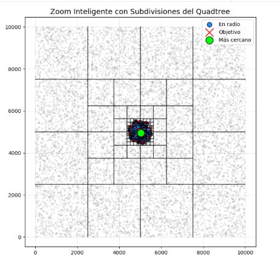
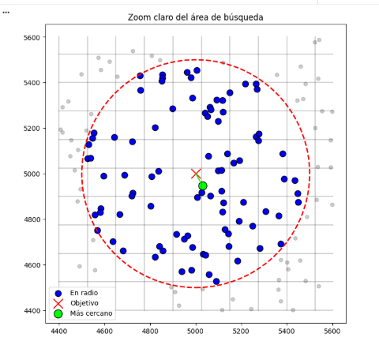
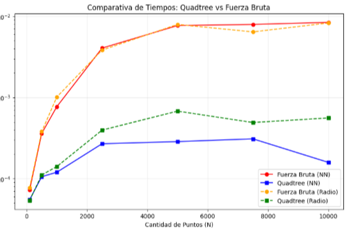

### Laboratorio 3

Este proyecto implementa desde 0 un Quadtree para resolver problemas de filtro espacial. El problema planteado consiste en un escenario de 10000 puntos de entrega estáticos. Se debe construir un programa que:
Sea capaz de localizar todos los puntos de entrega en un radio de x metros.
Sea capaz de identificar cuál es el punto de entrega más cercano a un punto dado.

Se dio solución al problema a través de un software desarrollado en Python (específicamente un Notebook de colab, para mejor visualización), utilizando la libería de visualización Matplotlib para validar los datos y el análisis de rendimiento.

Valga aclarar que la solución propuesta es únicamente válida para puntos de dos dimensiones. Sin embargo, es posible escalarla a 3, 4 o k dimensiones.

### Objetivos
El objetivo principal del problema es comparar la eficiencia de una lista o una búsqueda lineal, y un Quadtree, a la hora de realizar una búsqueda. 

### Construccion:

Partición espacial: El árbol divide el espacio en subregiones basandose en puntos medios, de manera que las subregiones en cada nivel del arbol son simetricas. En principio se halla el punto medio entre el minimo de los datos y el maximo de los datos, y se realizan cuatro divisiones: Izquierda arriba, izquierda-abajo, derecha-arriba, derecha-abajo. Así sucesivamente, hasta que cada subregión encierre un único punto.

Descarte de regiones: El programa descarta regiones enteras del mapa donde matemáticamente es imposible encontrar un mejor punto, reduciendo considerablemente el número de comparaciones.

Gráfica de lo encontrado: Para confirmar que el algoritmo funciona correctamente, el programa genera una gráfica donde se puede ver:

* El punto objetivo: Marcado claramente para saber desde dónde estamos buscando (x roja).
* Puntos en el radio: Los puntos que están dentro de la distancia permitida se resaltan con un color diferente (puntos azules).
* El más cercano: Se señala específicamente cuál es el punto que está a menor distancia (punto verde).
* El resto de puntos: Se muestran todos los demás puntos para ver cómo el árbol los clasificó y descartó (gris, por fuera del circulo rojo).

*Figura 1: Visualización del espacio subdividido en regiones, junto con los puntos presentes en cada una.*

*Figura 1: Acercamiento de los puntos encontrados y el área de búsqueda.*

*Figura 3: Comparación entre ambas estructuras de datos al buscar por radio y por más cercano.

### Organizacion del proyecto

Para cumplir con los requerimientos técnicos, se hizo un Notebook en colab, en el que se separó por celdas:
* Una celda de código asociada a la construcción del árbol y su lógica
* Una celda de código para la parte de creación de los puntos
* Dos celdas de código para la de validación y visualización gráfica.
* Una celda de código para el análisis y comparaciones (con gráfica)

Cada celda de código tiene una celda de texto que explica lo que hay en el código o conceptualiza. 
Todo el código está debidamente documentado.

### Uso del programa

Para la ejecucion del programa, ejecutar las celdas de codigo en orden. El programa hace las validaciones estadistico para el analisis (promedia sobre 100 ejecuciones). En caso de querer cambiar el numero de datos a utilizar, se cambia el arreglo de los tamaños usados. 
