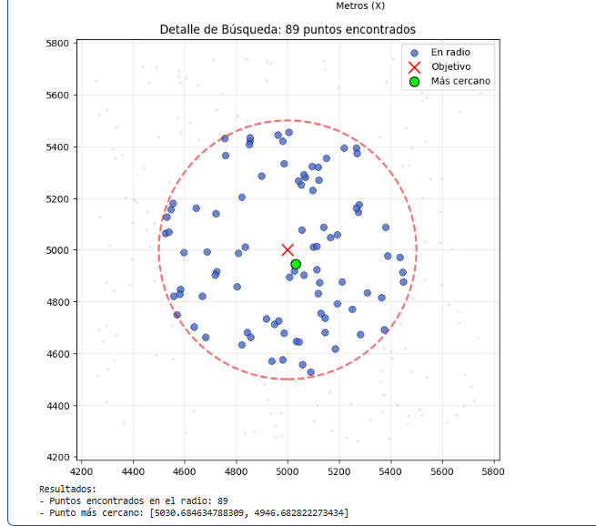
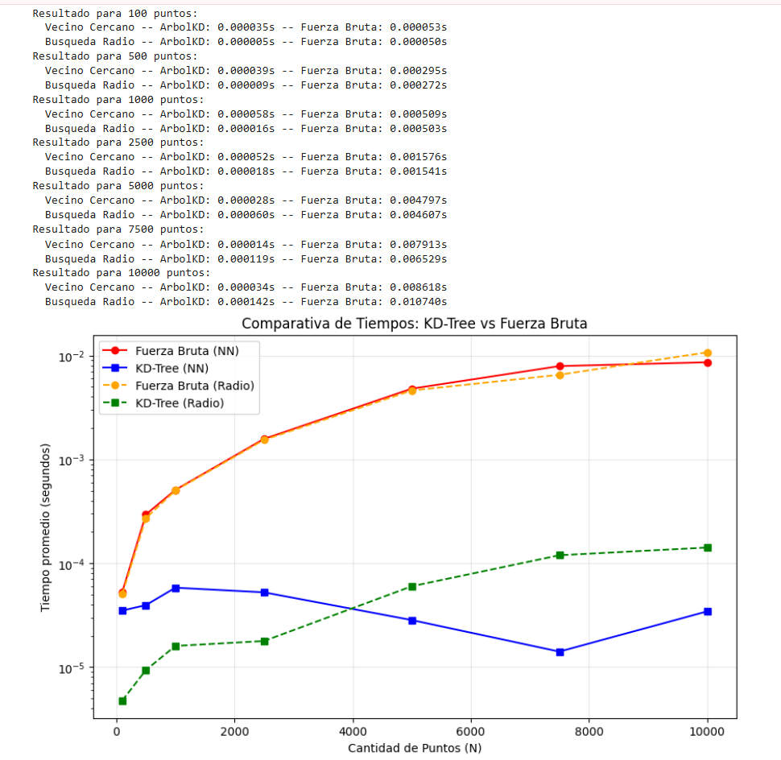

### Laboratorio 3

Este proyecto implementa desde 0 un árbol KD para resolver problemas de filtro espacial. El problema planteado consiste en un escenario de 10000 puntos de entrega estáticos. Se debe construir un programa que:
Sea capaz de localizar todos los puntos de entrega en un radio de x metros.
Sea capaz de identificar cuál es el punto de entrega más cercano a un punto dado.

Se dio solución al problema a través de un software desarrollado en Python (específicamente un Notebook de colab, para mejor visualización), utilizando la libería de visualización Matplotlib para validar los datos y el análisis de rendimiento.

### Objetivos
El objetivo principal del problema es comparar la eficiencia de una lista o una búsqueda lineal, y un árbol KD, a la hora de realizar una búsqueda. 

### Construccion:

Partición espacial: El árbol divide el espacio mediante hiperplanos basados en la mediana de los datos con respecto a una dimensión, alternando los ejes X ý Y.

Descarte de regiones: El programa descarta regiones enteras del mapa donde matemáticamente es imposible encontrar un mejor punto, reduciendo considerablemente el número de comparaciones.

Gráfica de lo encontrado: Para confirmar que el algoritmo funciona correctamente, el programa genera una gráfica donde se puede ver:

* El punto objetivo:Marcado claramente para saber desde dónde estamos buscando.
* Puntos en el radio: Los puntos que están dentro de la distancia permitida se resaltan con un color diferente.
* El más cercano: Se señala específicamente cuál es el punto que está a menor distancia.
* El resto de puntos: Se muestran todos los demás puntos para ver cómo el árbol los clasificó y descartó.

*Figura 1: Vista visual de los puntos encontrados y el área de búsqueda.*

### Analisis comparativo y resultados

A través del programa se pudo identificar el punto en que el **Arbol KD** supera considerablemente a **fuerza bruta**

* Punto de quiebre: En la prueba, el arbol KD muestra ventaja de manera considerable a partir de los 500 puntos.
* Escalabilidad: Mientras que la busqueda lineal tarda cada vez más conforme crece el numero de puntos, el arbol KD se mantiene estable, siendo hasta 300 veces más rápido en el escenario de 10000 puntos.
* Conclusión técnica: El uso de la partición espacial es indispensable para sistemas de ubicaciones reales, ya que realiza consultas de forma mucho más eficientes.

*Figura 2: Comparación entre ambas estructuras de datos al buscar por radio y por más cercano.

### Organizacion del proyecto

Para cumplir con los requerimientos técnicos, se hizo un Notebook en colab, en el que se separó por celdas:
* Una celda de código asociada a la construcción del árbol y su lógica
* Una celda de código para la parte de validación gráfica y creación de los puntos
* Una celda de código para el análisis y comparaciones (con gráfica)

Cada celda de código tiene una celda de texto que explica lo que hay en el código o conceptualiza. 
Todo el código está debidamente documentado.

### Uso del programa

Para la ejecucion del programa, ejecutar las celdas de codigo en orden. El programa hace las validaciones estadistico para el analisis (promedia sobre 100 ejecuciones). En caso de querer cambiar el numero de datos a utilizar, se cambia el arreglo de los tamaños usados. 
